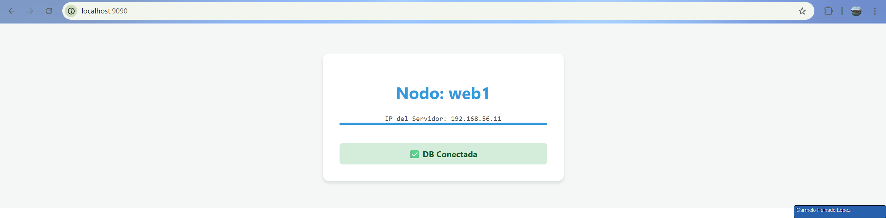
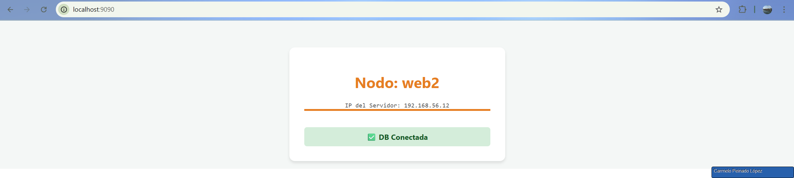
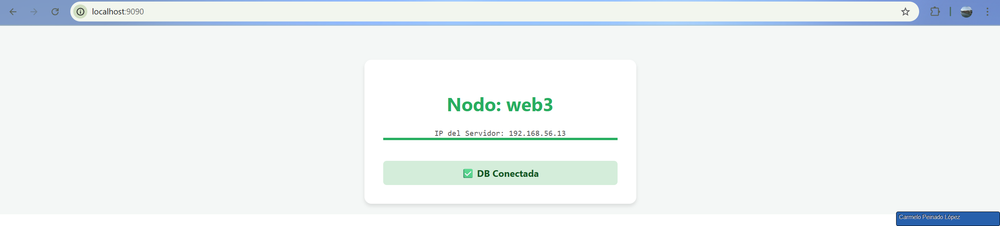

# Cluster Web de Alta Disponibilidad con Balanceo de Carga
## 🚀 Proyecto Final de Infraestructura y Despliegue

Este proyecto consiste en el despliegue automatizado de una arquitectura web de tres capas utilizando **Vagrant** y **VirtualBox**. La infraestructura garantiza alta disponibilidad mediante un balanceador de carga que distribuye el tráfico entre tres servidores web redundantes, todos conectados a una base de datos centralizada.

---

## 🏗️ Arquitectura del Clúster

El sistema está compuesto por **5 máquinas virtuales** ejecutando Ubuntu 20.04 LTS (Focal Fossa), configuradas de la siguiente manera:

| Máquina | Rol | Hostname | IP Privada | RAM | Servicios |
| :--- | :--- | :--- | :--- | :--- | :--- |
| **LB** | Balanceador | `lb` | `192.168.56.10` | 512 MB | Nginx |
| **WEB 1** | Servidor Web | `web1` | `192.168.56.11` | 1024 MB | Apache + PHP |
| **WEB 2** | Servidor Web | `web2` | `192.168.56.12` | 1024 MB | Apache + PHP |
| **WEB 3** | Servidor Web | `web3` | `192.168.56.13` | 1024 MB | Apache + PHP |
| **DB** | Base de Datos | `db` | `192.168.56.20` | 2048 MB | MySQL Server |


---

## 📂 Estructura de Ficheros

* **`Vagrantfile`**: Orquestador principal que define las características de las VMs (nombres, IPs, recursos y scripts de inicio).
* **`config-files/`**: Contiene archivos estáticos de configuración.
    * `nginx.conf`: Configuración del bloque `upstream` para el balanceo.
    * `vhost.conf`: Configuración del host virtual para los servidores Apache.
* **`scripts/`**: Scripts de automatización en Bash.
    * `common.sh`: Herramientas comunes de diagnóstico (htop, vim).
    * `lb.sh`: Despliegue de Nginx y aplicación de reglas de proxy.
    * `web.sh`: Despliegue del entorno LAMP (Linux, Apache, PHP, MySQL-Client) y generación de la interfaz visual.
    * `db.sh`: Instalación de MySQL, configuración de acceso remoto (bind-address) y creación de usuarios.

---

## 🛠️ Implementación Técnica Detallada

### 1. Balanceo de Carga
Se utiliza **Nginx** como balanceador. El archivo `nginx.conf` define un grupo de servidores `upstream` donde se listan las IPs de los tres nodos web. El algoritmo utilizado es **Round Robin**, asegurando un reparto equitativo de las peticiones.

### 2. Nodos Web y Feedback Visual
Cada nodo web ejecuta Apache con el módulo de PHP habilitado. Se ha implementado una característica de **identidad visual dinámica** en el script `web.sh`:
* **Colores Distintivos**: `web1` (Azul), `web2` (Naranja), `web3` (Verde).
* **Auditoría de Red**: La página muestra la **IP exacta** del servidor que responde (`$_SERVER['SERVER_ADDR']`), lo que permite verificar el balanceo sin ambigüedades.
* **Validación de Datos**: Cada carga de página realiza un intento de conexión a la máquina `db` para confirmar la salud del clúster.

### 3. Persistencia de Datos
El servidor MySQL (`db`) está configurado para aceptar conexiones externas mediante la modificación de `bind-address = 0.0.0.0`. Se utiliza el método `mysql_native_password` para garantizar que los controladores de PHP puedan autenticarse correctamente sin conflictos de seguridad modernos.

---

## 🚀 Guía de Despliegue

1. **Requisitos**: Tener instalados Vagrant y VirtualBox.
2. **Inicio**: Ejecutar en la terminal desde la raíz del proyecto:
   ```bash
   vagrant up
3. **Acceso**: Una vez finalizado, abrir el navegador en: http://localhost:9090


---

## 🚀 Comprobación de Alta Disponibilidad
Para demostrar que el sistema es resiliente, se pueden realizar las siguientes pruebas:
1. **Refrescar Navegador**: Verás cómo el "Nodo Activo" cambia entre web1, web2 y web3, alternando colores e IPs.






2. **Caída de nodo**: 
   ```bash
   vagrant halt web1
Al refrescar el navegador, el balanceador detectará que web1 no responde y servirá la web exclusivamente desde web2 y web3. El servicio nunca se interrumpe.

# 🎓 Conclusiones y Aprendizajes

Este proyecto ha permitido profundizar en el concepto de **Infraestructura como Código (IaC)**. A lo largo del desarrollo, los principales retos superados fueron:

* **Gestión de seguridad en bases de datos:** Resolución de problemas con permisos remotos en MySQL y ajustes en la compatibilidad de métodos de autenticación de contraseñas con PHP.
* **Seguridad de red:** Orquestación de redes privadas virtuales para garantizar una arquitectura robusta, asegurando que únicamente el balanceador de carga esté expuesto al tráfico exterior.
* **Automatización y monitorización:** Implementación de una interfaz web automatizada que actúa como herramienta de control y monitorización visual del estado del clúster.

---

**Autor:** [Carmelo Peinado López]  
**Curso:** [2º ASIR]